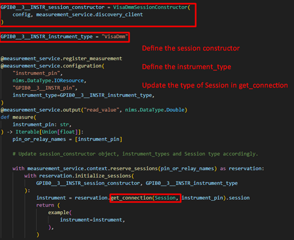

# Measurement Plug-In Converter for Python

- [Measurement Plug-In Converter for Python](#measurement-plug-in-converter-for-python)
  - [Introduction](#introduction)
  - [Dependencies](#dependencies)
  - [How to install?](#how-to-install)
  - [How to run?](#how-to-run)
    - [Measurement Plug-In Converter](#measurement-plug-in-converter)
      - [Prerequisites](#prerequisites)
      - [Supported data types](#supported-data-types)
      - [Supported instrument drivers](#supported-instrument-drivers)
      - [Additional steps for VISA instruments](#additional-steps-for-visa-instruments)
      - [Event logger](#event-logger)
      - [Limitations](#limitations)
    - [Measurement Plug-In UI Creator](#measurement-plug-in-ui-creator)
      - [Create measurement plug-in UI file](#create-measurement-plug-in-ui-file)
      - [Update measurement plug-in UI file](#update-measurement-plug-in-ui-file)
      - [Prerequisites](#prerequisites-1)
      - [Supported data types](#supported-data-types-1)
      - [Supported data elements](#supported-data-elements)
      - [Unsupported data elements for update command](#unsupported-data-elements-for-update-command)
      - [Event logger](#event-logger-1)
      - [Limitations](#limitations-1)

## Introduction

Measurement Plug-In Converter for Python has the following packages

- The Measurement Plug-In Converter is a CLI tool to convert traditional Python measurements into measurement plug-ins.
- The Measurement Plug-In UI Creator is a CLI tool to create or update `.measui` files for measurement plug-ins.

## Dependencies

- Measurement Plug-In Converter

  - [Python = ^3.8](https://www.python.org/downloads/release/python-385/)
  - [NI Measurement Plug-In UI Creator](dependencies/ni_measurement_plugin_ui_creator-1.0.0-py3-none-any.whl)

- Measurement Plug-In UI Creator

  - [Python = ^3.8](https://www.python.org/downloads/release/python-385/)

## How to install?

- Measurement Plug-In Converter

  - Place the UI Creator and the Plug-In Converter wheel files parallel to the [install.bat](batch_files/install.bat).
  - Run the `install.bat` file by double clicking it.

- Measurement Plug-In UI Creator

  - Place the UI Creator wheel file parallel to the [install.bat](batch_files/install.bat).
  - Run the `install.bat` file by double clicking it.

## How to run?

### Measurement Plug-In Converter

- Open Command Prompt.
- Run the following command to know the required CLI arguments.

  ```cmd
  ni-measurement-plugin-converter --help
  ```

  ```cmd
  Usage: ni-measurement-plugin-converter [OPTIONS]

    Convert Python measurements to Python Measurement plug-ins.

  Options:
    -d, --display-name TEXT         Display name for the plug-in that will be
                                    converted.  [required]
    -m, --measurement-file-path TEXT
                                    Path to the directory containing the Python
                                    measurement file to be converted.
                                    [required]
    -f, --function TEXT             Name of the function within the measurement
                                    file --measurement-file-path that contains
                                    the measurement logic.  [required]
    -o, --directory-out TEXT        Output directory for measurement plug-in
                                    files.  [required]
    -h, --help                      Show this message and exit
  ```

- Run the following command to convert Python measurements to measurement plug-ins.

  ```cmd
  ni-measurement-plugin-converter -d "<display_name>" -m "<measurement_file_path>" -f "<measurement_function_name>" -o "<output_directory>"
  ```

#### Prerequisites

- The Python measurement should have a measurement function.
- The measurement function should use at least one of the supported [instrument drivers](#supported-instrument-drivers) and [data types](#supported-data-types).
  The inputs and outputs of unsupported data types will be skipped.
- The measurement function must return a value through a variable. Assign the return value to a variable first, and then return that variable.
  Returning a function call or a constant value directly is not supported.

  ```py
  # Unsupported format
  def measurement() -> List[float]:
    # Measurement logic.
    return measure_voltages()

  # Supported format
  def measurement() -> List[float]:
    # Measurement logic.
    voltages = measure_voltages()
    return voltages
  ```

- The measurement function should have clear and accurate type hints for all input and output parameters.

  ```py
  # Unsupported format
  def measurement(voltage, current):
    # Measurement logic.
    resistance = voltage / current
    return resistance
  
  # Supported format
  def measurement(voltage: int, current: float) -> float:
    # Measurement logic.
    resistance = voltage / current
    return resistance
  ```

- The measurement function should have the instrument driver’s session initialization within the measurement function, indented at the next level.

  ```py
  # Unsupported format
  def measurement(voltage: int, current: float) -> float:
    if voltage:
      with nidcpower.Session("DCPower1") as session:
        # Measurement logic.
        return current

  # Supported format
  def measurement(voltage: int, current: float) -> float:
    with nidcpower.Session("DCPower1") as session:
      # Measurement logic.
      return current
  ```

- The measurement function should consolidate all instrument driver session initializations at a single point using the `with` context manager.

  ```py
  # Unsupported format
  def measurement(voltage: int, current: float) -> float:
    with nidcpower.Session("DCPower1") as dcpower_session:
      with nidmm.Session("DMM1") as dmm_session:
        # Measurement logic.
        return current

  # Unsupported format
  def measurement(voltage: int, current: float) -> float:
    with nidcpower.Session("DCPower1") as dcpower_session:
        # Measurement logic.

    with nidmm.Session("DCPower1") as dmm_session:
        # Measurement logic.
    
    return current

  # Supported format
  def measurement(voltage: int, current: float) -> float:
    with nidcpower.Session("DCPower1") as dcpower_session, nidmm.Session("DMM1") as dmm_session:
      # Measurement logic.
      return current
  ```

#### Supported data types

- Integer
- Float
- String
- Boolean
- 1D array of the above types

#### Supported instrument drivers

- NI-DCPower
- NI-DMM
- NI-Digital Pattern Driver
- NI-FGEN
- NI-SWITCH
- NI-SCOPE
- NI-DAQmx
- NI-VISA

#### Additional steps for VISA instruments

For measurements that use VISA instruments, the `session_constructor`, session type and `instrument_type` must be updated with appropriate values.


Steps to be followed

- Define the gRPC device server support.
- Define the session class for the instrument type.
- Define the session constructor for the instrument type.

  

- For `session_constructor`, create SessionConstructor object of the instrument driver used.
- For `instrument_type`, use the pin map instrument type id.
- For session type, the type of session should be passed.

For details, refer [Examples](https://github.com/ni/measurement-plugin-python/tree/releases/2.1/examples/nivisa_dmm_measurement).


#### Event logger

- The tool generates a log at the start of the conversion process, recording all actions performed throughout.
- The log file is located in the output directory.
- This log includes detailed information on any errors encountered during the process.

#### Limitations

- Class-based measurements are not supported for conversion.
- Data types such as `Path`, `Enum`, `DoubleXYData`, and their array variants are not supported.
- The measurement plug-in UI generated by the tool will exclude controls and indicators for the boolean lists.
- For measurements using VISA instruments, follow the [additional steps](#additional-steps-for-visa-instruments) after conversion.

### Measurement Plug-In UI Creator

- Open Command Prompt.
- Run the following command to know the available commands.

  ```cmd
  ni-measurement-plugin-ui-creator --help
  ```

  ```cmd
  Usage: ni-measurement-plugin-ui-creator [OPTIONS] COMMAND [ARGS]...

  NI Measurement Plug-In UI Creator is a Command Line tool to create/update 
  .measui files.

  Options:
    -h, --help  Show this message and exit.

  Commands:
    create  Create a new measurement plug-in UI file.
    update  Update the measurement plug-in UI file.
  ```

#### Create measurement plug-in UI file

The create command will create a new UI file for the selected active measurement.

- Run the following command to create new `.measui` file(s).

  ```cmd
  ni-measurement-plugin-ui-creator create
  ```

  ```cmd
  Starting the NI Measurement Plug-In UI Creator...
  Supported UI Elements: ['Boolean Horizontal Slider', 'Boolean Round LED', 'Numeric Array Input', 'Numeric Array Output', 'Numeric Control', 'Numeric Indicator', 'Pin', 'String Array Input', 'String Array Output', 'String Control', 'String Indicator']
  Getting the active measurements...

  Registered measurements:
  1. First Measurement (Py)
  2. Second Measurement (Py)

  Select a measurement service index (1-2) to update/generate measui file:
  ```

- Select the measurement by entering the number for which the UI file has to be created.

  ```cmd
  Measurement Plug-In UI created successfully at <Measurement Plug-In UI file path>
  Process completed.
  ```

- The UI file will be created in the current working directory.

#### Update measurement plug-in UI file

The update command will update the UI file by

- Linking controls and indicators to its respective inputs and outputs if there are any controls and indicators unlinked
- Creating new controls and indicators and linking it to the inputs and outputs.

- Run the following command to update `.measui` files.

  ```cmd
  ni-measurement-plugin-ui-creator update
  ```

  ```cmd
  Starting the NI Measurement Plug-In UI Creator...
  Supported UI Elements: ['Boolean Horizontal Slider', 'Boolean Round LED', 'Numeric Array Input', 'Numeric Array Output', 'Numeric Control', 'Numeric Indicator', 'Pin', 'String Array Input', 'String Array Output', 'String Control', 'String Indicator']
  Getting the active measurements...

  Registered measurements:
  1. First Measurement (Py)
  2. Second Measurement (Py)

  Select a measurement service index (1-2) to update/generate measui file:
  ```

- Select the measurement by entering the number.

  ```cmd
  Available Measurement Plug-In UI Files:
  1. First measui file path
  2. Second measui file path
  Select a measurement plug-in UI file index (1-2) to update:
  ```

- Select the measurement plug-in UI file which has to be updated by entering the number.

  ```cmd
    Binding UI controls and indicators...
    Creating new controls and indicators...
    Measurement plug-in UI updated successfully. Please find at <Measurement Plug-In UI file path>
    Process completed.
  ```

- The updated file will be suffixed with `_updated`.

#### Prerequisites

For update command,

- The selected measurement plug-in UI file should have been created using the Measurement Plug-In UI Editor.
- Atleast one control/indicator should be present in the measurement plug-in UI file.

#### Supported data types

- Int
- Float
- String
- Boolean
- Pin
- 1D array of int, float, string

#### Supported data elements

- Numeric Indicator
- Numeric Control
- Numeric Array Input
- Numeric Array Output
- Horizontal Slider
- Round LED
- String Control
- String Indicator
- String Array Input
- String Array Output
- Pin

#### Unsupported data elements for update command

- Path Control
- Enum Control
- Enum Indicator
- Ring Control
- Ring Indicator
- Graph Array Output
- Progress Bar

#### Event logger

- The tool generates a log at the start of the conversion process, recording all actions performed throughout.
- The log file is located inside the "ui_creator_logs" folder within the output directory.
- This log includes detailed information on any errors encountered during the process.

#### Limitations

- For the update command, if an unsupported data element exists in the input UI file and is not linked to any input or output, it will remain unbound and will not be updated. New elements will be created for inputs and outputs if their data types are [supported](#supported-data-types).
- Data types such as `Path`, `Enum`, `DoubleXYData`, and their 1D array variants are not supported.
