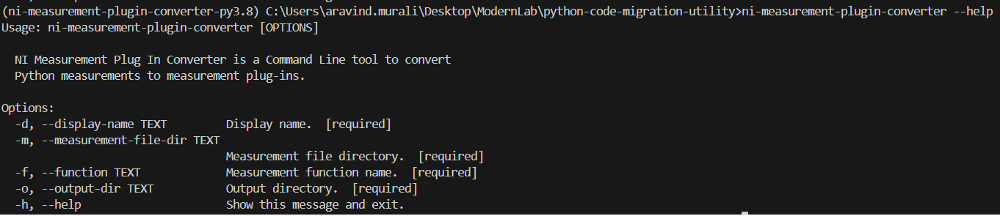

# NI Measurement Plug In Converter

- [NI Measurement Plug In Converter](#ni-measurement-plug-in-converter)
  - [Who](#who)
  - [Related links](#related-links)
  - [Problem statement](#problem-statement)
  - [Workflow](#workflow)
    - [User workflow](#user-workflow)
    - [Architecture workflow](#architecture-workflow)
  - [Design \& Implementation](#design--implementation)
    - [CLI Inputs](#cli-inputs)
    - [Prerequisites](#prerequisites)
    - [Supported Data Types and Instrument Drivers.](#supported-data-types-and-instrument-drivers)
    - [Outputs](#outputs)
    - [Logger Implementation](#logger-implementation)
  - [Alternative implementations / Designs](#alternative-implementations--designs)
  - [Open items](#open-items)

## Who

Author: National Instruments \
Team: ModernLab Success

## Related links

[Feature - Python Code Migration Utility](https://dev.azure.com/ni/DevCentral/_backlogs/backlog/ModernLab%20Reference%20Architecture/Epics/?workitem=2809380)

## Problem statement

- A test engineer who develops Python measurements needs to convert those Python measurements to measurement plugins. `NI Measurement Plug In Converter` solves the problem of manual conversion and helps in automating the conversion process.

## Workflow

### User workflow


### Architecture workflow


## Design & Implementation

The solution is to create a Python package that helps in automating the conversion process. The Python package can be a CLI tool that prompts the user to provide the display name, the input file directory where the Python measurement is located, the name of the measurement function, and the output directory where the measurement plug-in will be created.

### CLI Inputs

- The display name is used in the service configuration file. The service configuration file is named `<display_name>.serviceconfig`.
- The inputted file directory will be validated and raised error if there is no such file.
- The measurement function will be validated and an error will be raised if the measurement function is not available in the measurement file.
- The output directory will be created if it does not exist.

To run the CLI tool,
```
ni-measurement-plugin-converter --display-name <display name> --measurement-file-dir <measurement-file-directory> --function <measurement function name> --output-dir <output directory>
```



### Prerequisites

The following are the prerequisites that the inputted user Python measurements should comply with

- It should contain a measurement function which should
  - Contain a return value.
  - Have properly type hinted inputs and outputs.
  - Use one of the supported drivers.
- Initialize the instrument driver's session inside the measurement function.

### Supported Data Types and Instrument Drivers.

The supported data types are

- Integer
- Float
- String
- Boolean
- List of integers
- List of floats
- List of strings
- List of booleans

The supported instrument drivers are

- NI-DCPower
- NI-DMM
- NI-Digital
- NI-FGEN
- NI-Switch
- NI-Scope
- NI-DAQmx

The CLI tool skips the unsupported data types' inputs and outputs of the measurement function and informs through corresponding messages in the command line interface and logs it in the log file. 

### Outputs

The following files are created as part of the measurement plug-in directory.

| File                         | Description                                                     |
| ---------------------------- | --------------------------------------------------------------- |
| measurement.py               | Measurement file.                                               |
| _migrated.py                 | Copy of the user file with some changes.                        |
| <display_name>.serviceconfig | Service configuration file.                                     |
| _helpers.py                  | `TestStand` support file.                                       |
| start.bat                    | Batch file with commands to run the measurement.py.             |
| log.txt                      | Log file which contains the conversion process status messages. |


The `measurement.py` file is the main file where the measure function is defined with inputs and outputs in the measurement plug-in format. The reservation of the instrument driver's session is done within the measurement function. The user-defined measurement function is the return value of the measure function. The reservation object is sent as one of the arguments to the user-defined measurement function.

The `_migrated.py` file is the copy of the user-inputted measurement file with the following changes.
- An additional parameter `reservation` is added in the user measurement function.
- The initialization of the instrument driver's session is done with the reservation object.
- The session object is replaced

### Logger Implementation

Logger implementation plays a crucial role in this tool for displaying the status messages of the converted measurement and as a debugger for debugging any unexpected behavior.
Two types of loggers have been implemented in this tool, one is a `Console logger` and another is a `File logger`. Console logger is used for displaying messages in the console whereas the File logger is used for logging all types of messages in a separate file called `log.txt`. Both the logger logs the messages in different formats. The console logger logs the message as plain text whereas the file logger logs the messages along with the time stamp.

For example,


The console logger gets loaded and then the file logger. The file logger contains all messages, including console messages, as well as any exceptions that occurred during the **execution**.

The log file will be created at the user-provided output path.

## Alternative implementations / Designs

- No alternative implementations.

## Open items

- It supports integer, float, string, boolean, and their array counterpart data types only.
- It supports NI-DCPower, NI-DMM, NI-Digital, NI-FGEN, NI-Switch, NI-Scope, and NI-DAQmx instrument drivers only.
- The user measurements should contain a measurement function with properly type hinted return value.
- Initialization of the instrument driver's session should be done inside the measurement function.
- The measurement plug-in created by this tool doesn't include a measurement UI file.
