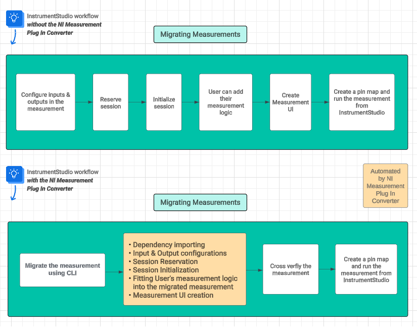
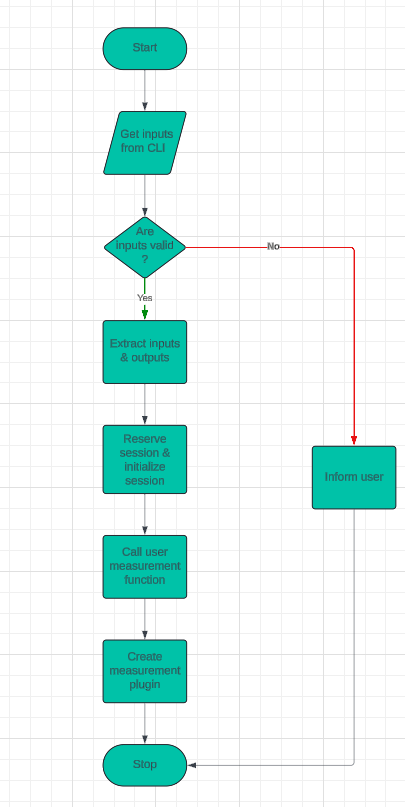
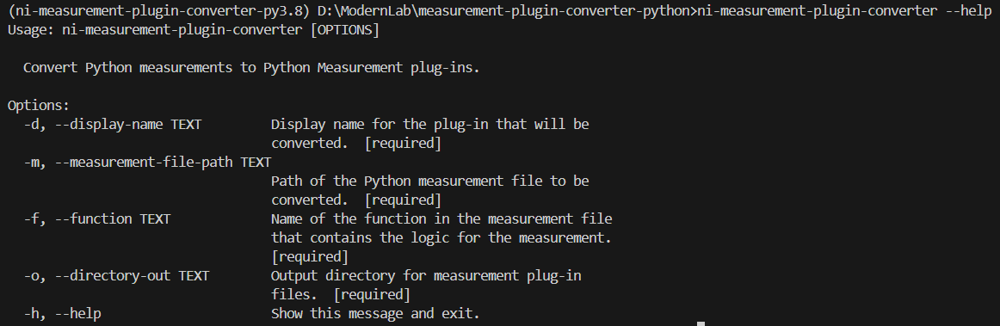
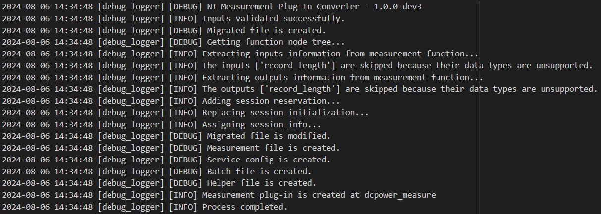

# NI Measurement Plug-In Converter

- [NI Measurement Plug-In Converter](#ni-measurement-plug-in-converter)
  - [Who](#who)
  - [Related links](#related-links)
  - [Problem statement](#problem-statement)
  - [Workflow](#workflow)
    - [User workflow](#user-workflow)
    - [Architecture](#architecture)
  - [Design \& Implementation](#design--implementation)
    - [CLI Inputs](#cli-inputs)
    - [Prerequisites](#prerequisites)
    - [Supported Data Types and Instrument Drivers](#supported-data-types-and-instrument-drivers)
    - [Outputs](#outputs)
    - [Additional steps for VISA instruments](#additional-steps-for-visa-instruments)
    - [Logger Implementation](#logger-implementation)
  - [Alternative implementations / Designs](#alternative-implementations--designs)
  - [Open items](#open-items)

## Who

Author: National Instruments \
Team: ModernLab Success

## Related links

[Feature - Python Code Migration Utility](https://dev.azure.com/ni/DevCentral/_backlogs/backlog/ModernLab%20Reference%20Architecture/Epics/?workitem=2809380)

## Problem statement

- A test engineer who develops Python measurements needs to convert those Python measurements to measurement plug-ins. `NI Measurement Plug-In Converter` aims to solve the problem of manual conversion and will help in automating the conversion process.

## Workflow

### User workflow



### Architecture



## Design & Implementation

The solution is to create a Python package that helps in automating the conversion process. The Python package can be a CLI tool that prompts the user to enter the display name, the input file directory where the Python measurement is located, the name of the measurement function, and the output directory where the measurement plug-in will be created.

### CLI Inputs

- The display name will be used in the service configuration file and measui file. The service configuration file will be named in the format `<display_name>.serviceconfig` and measui file will be named in the format `<display_name>.measui`.
- The inputted file directory will be validated and raised error if there is no such file.
- The measurement function will be validated and an error will be raised if the measurement function is not available in the measurement file.
- The output directory will be created if it does not exist.

To run the CLI tool,

```cmd
ni-measurement-plugin-converter --display-name "<display name>" --measurement-file-path "<measurement-file-path>" --function "<measurement function name>" --output-dir "<output directory>"
```



### Prerequisites

The inputted Python measurement should

- Contain a measurement function which should
  - Contain a return value.
  - Have properly type hinted inputs and outputs.
  - Use one of the supported drivers.
- Initialize the instrument driver's session inside the measurement function.

### Supported Data Types and Instrument Drivers

Data types

- Integer
- Float
- String
- Boolean
- List of integers
- List of floats
- List of strings
- List of booleans

Instrument drivers

- NI-DCPower
- NI-DMM
- NI-Digital
- NI-FGEN
- NI-Switch
- NI-Scope
- NI-DAQmx
- NI-VISA

The above-listed data types and instrument drivers should be supported in the first version/prerelease. Going forward the tool will try to support all possible data types and instrument drivers available.

The CLI tool will skip the unsupported data types' inputs and outputs of the measurement function and will inform through corresponding messages in the command line interface and will log it in the log file.

### Outputs

The following files will be created as part of the measurement plug-in directory.

| File                         | Description                                           |
| ---------------------------- | ----------------------------------------------------- |
| measurement.py               | Measurement file.                                     |
| _migrated.py                 | Copy of the user file with some changes.              |
| <display_name>.serviceconfig | Service configuration file.                           |
| <display_name>.measui        | Measurement UI file.                                  |
| _helpers.py                  | `TestStand` support file.                             |
| start.bat                    | Batch file with commands to run the measurement.py.   |
| log.txt                      | Log file with the conversion process status messages. |

The `measurement.py` file is the main file where the measure function will be defined with the inputs and the outputs in the measurement plug-in format. The instrument driver's session will be reserved within the measurement function. The measure function will return the user-inputted measurement function. The session reservation object will be added as the argument to the user-inputted measurement function.

The `_migrated.py` file is the copy of the user-inputted measurement file with the following changes.
- An additional parameter `reservation` will be added to the user measurement function.
- The initialization of the instrument driver's session will be done with the reservation object.
- The session object will be replaced.

### Additional steps for VISA instruments

For measurement that use VISA instruments, the `session_constructor`, session type and `instrument_type` must be updated with appropriate values.


Steps to be followed

- Define the grpc support.
- Define the session class for the instrument type.
- Define the session constructor for the instrument type.

  

- For `session_constructor`, create SessionConstructor object of the instrument driver used.
- For `instrument_type`, use the pin map instrument type id.
- For session type, the type of session should be passed.

For details, refer [Examples](https://github.com/ni/measurement-plugin-python/tree/releases/2.0/examples/nivisa_dmm_measurement).


### Logger Implementation

The Logger will play a crucial role in this tool for displaying the status messages of the conversion process and as a debugger for debugging any unexpected behavior.
Two types of loggers will be implemented in this tool, one will be a `Console logger` and another will be a `File logger`. Console logger will be used for displaying messages in the console whereas the File logger will be used for logging all types of messages in a separate file called `log.txt`. Both the logger will log the messages in different formats. The console logger will log the message as plain text whereas the file logger will log the messages along with the time stamp.

For example,


The console logger will get loaded followed by the file logger. The file logger will contain all messages, including console messages, as well as any exceptions that occur during the execution.

The log file will be created in the user-provided output directory.

## Alternative implementations / Designs

- No alternative implementations.

## Open items

- Path, Enum, DoubleXYData and their array counterpart data types are yet to be supported.
- Conversion of class based measurements are not supported.
- Measurement UI generated by the tool will not include controls and indicators for list of booleans.
- For measurements that use VISA instruments, a few more [additional steps](#additional-steps-for-visa-instruments) must be followed.
