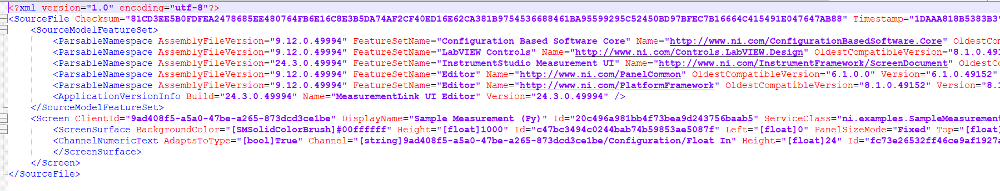

# NI Measurement UI Creator
- [NI Measurement UI Creator](#ni-measurement-ui-creator)
  - [Who](#who)
  - [Problem statement](#problem-statement)
  - [Links to relevant work items](#links-to-relevant-work-items)
  - [Implementation and Design](#implemenation-and-design)
    - [Workflow](#work-flow)
    - [Generation of measui files while Measurement migration](#generation-of-measui-files-while-measurement-migration)
    - [Generation of measui files after Measurement migration](#generation-of-measui-files-after-measurement-migration)
    - [Creating measui files](#creating-measui-files)
    - [Logger implementation](#logger-implementation)
  - [Installation](#installation)
  - [Alternative implementations and designs](#alternative-implementations-and-designs)
  - [Open issues](#open-issues)
  - [Future Plans](#future-plans)

## Who

Author: National Instruments </br>
Team: ModernLab Success

## Problem statement

- For the test engineer who develops Python measurements needs the `.measui` files to be updated as per the modified measurement, but they must do that manually after developing the measurements.

## Links to relevant work items

- [Feature - Automate Measurement UI Creation](https://dev.azure.com/ni/DevCentral/_sprints/taskboard/ModernLab%20Reference%20Architecture/DevCentral/24C3/08/08a?workitem=2742213)

## Implementation and Design

### Workflow

Create a Python package `NI Measurement UI Creator` which creates `.measui` files for the measurements, thereby reducing the manual efforts of creating measui files after modifying the measurement.

The CLI tool prompts the user with necessary information about the measurements and the output files created. The measui files will be created at the user-provided output path. If any error occurs, the tool prompts the user to go through the `log.txt` file which will be created in the same file location as the measui files. The active measurements in the system will be listed down for the user using the `ni_measurement_sdk_service` package.

It supports the following UI elements,

- Numeric Indicator
- Numeric Control
- Numeric Array Input
- Numeric Array Output
- Toggle Image Button
- Toggle Image Indicator
- String Control
- String Indicator

### Generation of measui files while Measurement migration

For the users, who want to generate measui files while migrating their measurement files as per `measurement plugin format`, they can use the helper functions written for this tool. This tool contains certain examples of using those helper functions in their measurement files.

### Generation of measui files after Measurement migration

For the users, who want to generate measui files after migration of their measurement files as per `measurement plugin format`, they have to run the migrated measurement and use the CLI implementation.

To start the CLI tool,

```
ni-measurement-ui-creator --ouput-directory <output_folder_path>
```

### Creating measui files

For creating measui files, the input and output configured in the measurement are required. It will create `xml` file contents for each supported UI element and finally create the `.measui` file.



### Logger implementation

Logger implementation plays a crucial role in this tool for displaying the status messages of the built measurement and as a debugger for debugging any unexpected behavior.
Two types of loggers have been implemented in this tool, one is a `Console logger` and another is a `File logger`. Console logger is used for displaying messages in the console whereas the File logger is used for logging all types of messages in a separate file called `log.txt`. Both the logger logs the messages in different formats. The console logger logs the message as plain text whereas the file logger logs the messages along with the time stamp.

For example,


The console logger gets loaded and then the file logger. The file logger contains all messages, including console messages, as well as any exceptions that occured during the execution.

The log file will be created under the folder `Logs` inside the user-provided output path, this folder will be created during the execution of the tool, if it does not exist.

## Installation

This python package can be installed using the pip install `<path_to_ni_measurement_ui_creator-X_X_X-py3-none-any.whl>` command.

## Alternative implementations and designs

No alternative implementations.

## Open issues

- It supports for only limited UI elements.

## Future Plans

- To integrate this tool with a measurement plugin converter to automate UI creation along with code migration.
