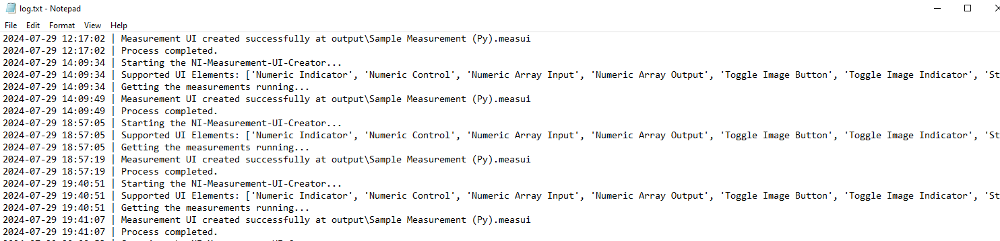

# NI Measurement UI Creator
- [NI Measurement UI Creator](#ni-measurement-ui-creator)
  - [Who](#who)
  - [Problem statement](#problem-statement)
  - [Links to relevant work items](#links-to-relevant-work-items)
  - [Implementation and Design](#implemenation-and-design)
    - [Workflow](#work-flow)
    - [Logger implementation](#logger-implementation)
  - [Installation](#installation)
  - [Alternative implementations and designs](#alternative-implementations-and-designs)
  - [Open issues](#open-issues)
  - [Future Plans](#future-plans)

## Who

Author: National Instruments </br>
Team: ModernLab Success

## Problem statement

- For a test engineer who develop python measurements needs their `.measui` files to be updated as per the modified measurement, but they have to do that manually after developing the measurements.

## Links to relevant work items

- [Feature - Automate Measurement UI Creation](https://dev.azure.com/ni/DevCentral/_sprints/taskboard/ModernLab%20Reference%20Architecture/DevCentral/24C3/08/08a?workitem=2742213)

## Implementation and Design

### Workflow

Create a Python package `NI Measurement UI Creator` which creates `.measui` files for the measurements, thereby reducing the manual efforts of creating measui files after modifying the measurement.

The CLI tool prompts the user with necessary information about the measurements and the output files created. The measui files measurements are available under the file location given by the user. If any unexpected event occurs, the tool prompts the user to go through the `log.txt` file which will be created in the same file location as measui files. The available running measurements in the system will listed down for the user using `ni_measurement_sdk_service` package, to create UI files for those measurements.

It supports the following the UI elements,

- Numeric Indicator
- Numeric Control
- Numeric Array Input
- Numeric Array Output
- Toggle Image Button
- Toggle Image Indicator
- String Control
- String Indicator

To start the cli tool,

```
ni-measurement-ui-creator --ouput-directory <output_folder_path>
```

#### Logger implementation

Logger implementation plays a crucial role in this tool for displaying the status messages of the built measurement and as a debugger for debugging any unexpected behavior.
Two types of loggers have been implemented in this tool, one is `console logger` and another is `File logger`. Console logger is used for displaying messages in the console whereas the File logger is used for logging all types of messages in a separate file called `log.txt`. Both the logger logs the messages with different formats, the console logger logs the message as plain text whereas the file logger logs the messages along with the time stamp.

For example,


Initially, the console logger gets loaded followed by the file logger. The file logger contains all messages, including console messages, as well as any exception messages and their traceback.

The log file will be created under the folder `Logs` inside the user-provided output path, these folders will be created during the execution of the tool, if it does not exist.

## Installation

This python package can be installed using the pip install `<path_to_ni_measurement_ui_creator-X_X_X-py3-none-any.whl>` command.

## Alternative implementations and designs

No alternative implementations.

## Open issues

- It supports for only limited UI elements.

## Future Plans

- To integrate this tool with measurement plugin converter to automate UI creation along with code migration.
