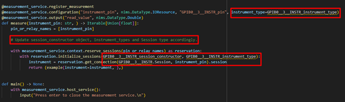
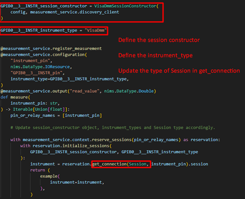
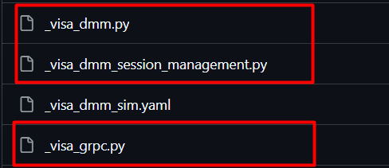

# NI Measurement Plug-In Converter

- [NI Measurement Plug-In Converter](#ni-measurement-plug-in-converter)
  - [Introduction](#introduction)
  - [Dependencies](#dependencies)
  - [How to install?](#how-to-install)
  - [How to run?](#how-to-run)
    - [Supported data types](#supported-data-types)
    - [Supported instrument drivers](#supported-instrument-drivers)
    - [Prerequisites](#prerequisites)
    - [Limitations](#limitations)
    - [Additional steps for VISA instruments](#additional-steps-for-visa-instruments)
    - [Event logger](#event-logger)

## Introduction

- NI Measurement Plug-In Converter for Python is a CLI tool to convert Python measurements to NI measurement plug-ins.

## Dependencies

- [Python = 3.8.5](https://www.python.org/downloads/release/python-385/)
- [NI Measurement UI Creator](../../dependencies/ni_measurement_ui_creator-1.0.0.dev8-py3-none-any.whl)

## How to install?

- Place the UI Creator and the Plug-In Converter wheel files parallel to the [install.bat](../../batch_files/install.bat).
- Run the `install.bat` file by double clicking it.

## How to run?

- Open Command Prompt.
- Run the following command to know the required CLI arguments.

  ```cmd
  ni-measurement-plugin-converter --help
  ```

  ```cmd
  Usage: ni-measurement-plugin-converter [OPTIONS]

    NI Measurement Plug-In Converter is a Command Line tool to convert     
    Python measurements to measurement plug-ins.

  Options:
    -d, --display-name TEXT         Display name.  [required]
    -m, --measurement-file-path TEXT
                                    Measurement file path.  [required]
    -f, --function TEXT             Measurement function name.  [required]
    -o, --output-dir TEXT           Output directory.  [required]
    -h, --help                      Show this message and exit.
  ```

- Run the following command to convert Python measurements to measurement plug-ins.

  ```cmd
  ni-measurement-plugin-converter -d "<display name>" -m "<measurement file path>" -f "<measurement function name>" -o "<output directory>"
  ```

### Supported data types

- Integer
- Float
- String
- Boolean
- List of integers
- List of floats
- List of strings
- List of booleans

### Supported instrument drivers

- NI-DCPower
- NI-DMM
- NI-Digital
- NI-FGEN
- NI-Switch
- NI-Scope
- NI-DAQmx
- NI-VISA

### Prerequisites

The Python measurement should contain a measurement function which should

- Use one of the supported [drivers](#supported-instrument-drivers) and [data types](#supported-data-types). Inputs and outputs of unsupported data types will be skipped.
- Contain a return value. The return value should be a variable and not a direct function call or constant value.

  ```py
  # Not supported
  def measurement_function() -> List[float]:
    # Measurement logic.
    return measure_voltages()

  # Supported
  def measurement_function() -> List[float]:
    # Measurement logic.
    voltages = measure_voltages()
    return voltages
  ```

- Have properly type hinted inputs and outputs.

  ```py
  # Not supported
  def measurement_function(voltage, current):
    # Measurement logic.
    resistance = voltage / current
    return resistance
  
  # Supported
  def measurement_function(voltage: int, current: float) -> float:
    # Measurement logic.
    resistance = voltage / current
    return resistance
  ```

- Have the instrument driver's session initialization inside the measurement function and within the next level of indentation.

  ```py
  # Not supported
  def measurement_function(voltage: int, current: float) -> float:
    if voltage:
      with nidcpower.Session("DCPower1") as session:
        # Measurement logic.
        return current

  # Supported
  def measurement_function(voltage: int, current: float) -> float:
    with nidcpower.Session("DCPower1") as session:
      # Measurement logic.
      return current
  ```

- Have all the instrument driver's session initialization at a single point using the context manager `with`

  ```py
  # Not supported
  def measurement_function(voltage: int, current: float) -> float:
    with nidcpower.Session("DCPower1") as dcpower_session:
      with nidmm.Session("DMM1") as dmm_session:
        # Measurement logic.
        return current

  # Supported
  def measurement_function(voltage: int, current: float) -> float:
    with nidcpower.Session("DCPower1") as dcpower_session, nidmm.Session("DMM1") as dmm_session:
      # Measurement logic.
      return current
  ```

### Limitations

- Conversion of class based measurements are not supported.
- Path, Enum, DoubleXYData and their array counterpart data types are yet to be supported.
- Measurement UI generated by the tool will not include controls and indicators for list of booleans.
- For measurements that use VISA instruments, a few more [additional steps](#additional-steps-for-visa-instruments) must be followed.

### Additional steps for VISA instruments

For measurement that use VISA instruments, the `session_constructor`, the session type and the `instrument_types` must be updated with appropriate values.



Steps to be followed

- Define the grpc support.
- Define the Session class for the instrument type.
- Define the session constructor for the instrument type.



- For `session_constructor`, create SessionConstructor object of the instrument driver used.
- For instrument_type, use the pin map instrument type id.
- For session type, the type of session should be passed.

For details, refer [Examples](https://github.com/ni/measurement-plugin-python/tree/releases/2.0/examples/nivisa_dmm_measurement)



### Event logger

- The tool will generate a log once the conversion process is started, documenting all the actions performed by the tool throughout the conversion process.
- Log file can be found in the output directory.
- The log includes the details about any errors encountered during the conversion process.